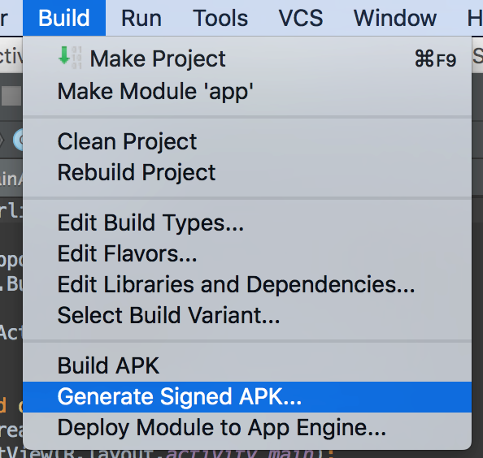
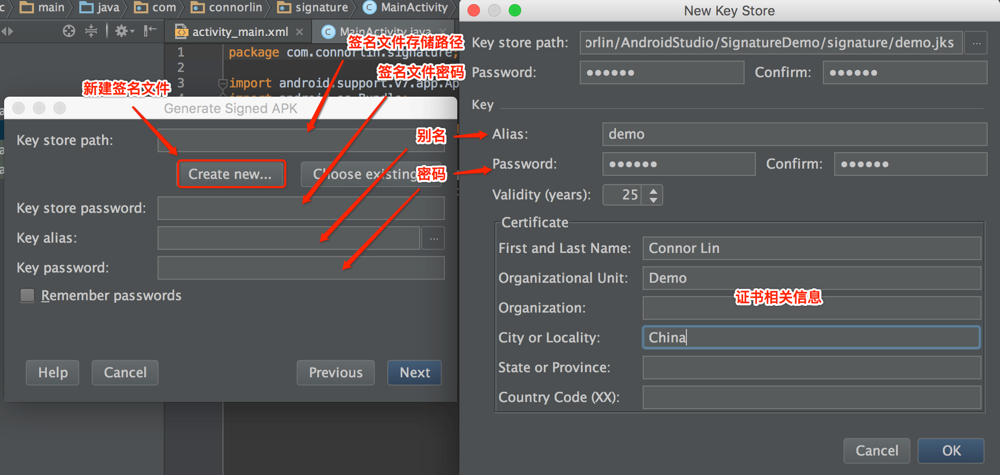

开发apk需要使用到系统权限就需要在AndroidManifest.xml中共享系统进程的属性：

```xml
android:sharedUserId="android.uid.system"
android:sharedUserId="android.uid.shared"
android:sharedUserId="android.media"
```

# 常用系统签名方式

##Android源码环境下签名

这种方式比较麻烦，你需要有编译过的源码环境，并按如下步骤：

1.  拷贝App源码到Android源码的package/apps/目录下，且App源码是普通（Eclipse）格式的。
2.  配置Android.mk，在其中添加：

    ```makefile
    LOCAL_CERTIFICATE := platform(media,shared)
    ```

3.  使用mm编译App，生成的apk即是系统签名。


##手动重新签名
这种方式比源码环境下签名简单，App可以在Eclipse和Android Studio下编译，然后给apk重新签名即可。 

但是这种方式在频繁Debug的时候毕竟痛苦，即使写成脚本，也需要重复一样的操作。
相关文件：platform.x509.pem、platform.pk8、signapk.jar

文件位置：

-   platform.x509.pem、platform.pk8：build/target/product/security
-   signapk.jar：out/host/linux-x86/framework
-   signapk源码路径：build/tools/signapk

签名命令：

```shell
java -jar signapk.jar platform.x509.pem platform.pk8 old.apk new.apk
```

old.apk ---->要签名的apk源文件
new.apk---->签名完成测apk文件

步骤：

1.  将相关文件及源apk文件置于同一路径下。
2.  检查源apk包，去掉META-INF/CERT.SF和META-INF/CERT.RSA文件。
3.  执行签名命令即可。

##Android Studio系统签名
让Android Studio集成系统签名，需要用到一个工具keytool-importkeypair，详见下文
这个工具的作用是将系统签名的相关信息导入到已有的签名文件里。GitHub地址：https://github.com/getfatday/keytool-importkeypair

相关文件
platform.x509.pem、platform.pk8、keytool-importkeypair、demo.jks
建议在项目创建一个专门的文件夹存放签名文件
步骤：

1.  生成demo.jks签名文件 

    

    

2.  执行命令修改demo.jks为系统的签名

    ```shell
    ./keytool-importkeypair -k demo.jks -p 123456 -pk8 platform.pk8 -cert platform.x509.pem -alias demo
    ```

    -k demo.jks --> 生成的签名文件

    -p 123456 --> 签名文件密码

    -alias demo --> 签名文件别名

3.  配置build.gradle 
  在android区域下(与defaultConfig同级)添加配置：

  ```java
  signingConfigs {
      release {
          storeFile file("../signature/demo.jks")
          storePassword '123456'
          keyAlias 'demo'
          keyPassword '123456'
      }

      debug {
          storeFile file("../signature/demo.jks")
          storePassword '123456'
          keyAlias 'demo'
          keyPassword '123456'
      }
  }
  ```

  这样debug或者release apk就带有系统签名了。

