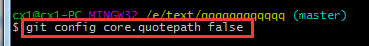

Git对中文的支持：
可以在提交说明中使用中文，但是需要对Git进行设置。至于用中文命名文件、目录和引用，只有在使用UTF-8字符集的环境下才可以，否则应尽量避免使用。

### 1.UTF-8字符集

提交时，可以在提交说明中输入中文；显示提交历史，能够正常显示提交说明中的中文字符；可以添加名称为中文的文件，并可以在同样使用UTF-8字符集的Linux环境中克隆和检出；可以创建带有中文字符的里程碑名称。但是在默认设置下，中文文件名在工作区状态输出、查看历史更改概要，以及在补丁文件中，文件名中的中文不能正确显示，而是显示为八进制的字符编码。设置$git config –global core.quotepath false可以解决中文文件名在这些Git命令输出中的显示问题。

原因：git 默认中文文件名是 xx%是因为 对0x80以上的字符进行quote，所以只需要使用*git config core.quotepath false*把core.quotepath设为false的话，就不会对0x80以上的字符进行quote。中文显示就正常了。实际测试可行

###2.GBK字符集

若Linux平台采用非UTF-8的字符集，就要另外再做些工作。 
将显示提交说明所使用的字符集设置为gbk，这样使用git log查看提交说明时才能够正确显示其中的中文$git config --global i18n.logOutputEncoding gbk 
设置录入提交说明时所使用的字符集，以便在commit对象中正确标注字符集$git config --global i18n.commitEncoding gbk。Git在提交时不会对提交说明进行从GBK字符集到UTF-8的转换，但是可以在提交说明中标注所使用的字符集，因此在非UTF-8字符集的平台中录入中文时需要用此指令设置录入提交说明的字符集，以便在commit对象中嵌入正确的编码说明。