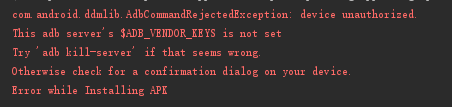

在使用adb的时候有时候会出现

```shell
com.android.ddmlib.AdbCommandRejectedException: device unauthorized
```

这样的错误，这个问题是adb被杀死了

有三种方法：

#一 可以在sdk的文件中找到plattform-tools，到这个文件夹里面去可以找到adb，

双击adb，就可以重新启动了

#二 也可以在cmd中，执行两步命令操作:

```shell
adb kill-server
adb start-server
```

#三 重启电脑

